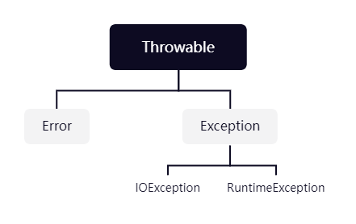

# 标准库

## 基本数据类型

| 基本类型  | 位数 | 字节 | 默认值  |
| --------- | :--- | ---- | ------- |
| `int`     | 32   | 4    | 0       |
| `short`   | 16   | 2    | 0       |
| `long`    | 64   | 8    | 0L      |
| `byte`    | 8    | 1    | 0       |
| `char`    | 16   | 2    | 'u0000' |
| `float`   | 32   | 4    | 0f      |
| `double`  | 64   | 8    | 0d      |
| `boolean` | 1    | 1    | false   |

:::warning

boolean理论上字节长度为1, 实际依赖于JVM的具体实现

:::

## 包装类型

所有基本型有对应的包装类型, 不再一一列举

基本型与包装型可自动拆箱装箱:

```java
// 装箱
Integer i = 10;
// 拆箱
int n = i;
```

部分包装类型实现了常量池:

| 常量池      | 范围              |
| ----------- | ----------------- |
| `Byte`      | [-128, 127]       |
| `Short`     | [-128, 127]       |
| `Integer`   | [-128, 127]       |
| `Long`      | [-128, 127]       |
| `Character` | [0, 127]          |
| `Boolean`   | `True`或者`False` |

:::danger

包装类型基于对象和常量池, 在比较时应使用`equals`方法

:::

## 注解

注解本质是继承了`Annotation`的接口

注解只有被解析后才会生效, 常见的解析方法有:

- 编译期扫描, 例如`@Override`
- 反射, 例如Spring的`@Component`

可以被继承的注解, 需要查看源码是否包含`@Inheritance`

## 接口与抽象类

在Java 8之后, 接口与抽象类的区别不再像以往那么明显:

| 功能                            | 接口 | 抽象类 |
| ------------------------------- | ---- | ------ |
| 定义私有属性                    | ×    | √      |
| 定义静态属性                    | √    | √      |
| 定义方法                        | √    | √      |
| 默认方法                        | √    | √      |
| 静态方法                        | √    | √      |
| 对象方法(`equals`/`hashCode`等) | ×    | √      |
| **多继承**                      | ⍻    | ×      |

接口的多继承并不真正意义上的多继承, 而是解决冲突的一种方案:

```java
public interface IPerson {
    // 静态方法
    static String getName() {
        return "person";
    }
}

public interface IMan {
    // 默认方法
    default Integer getSex() {
        return 1;
    }
}

public interface IWoman {
    // 默认方法
    default Integer getSex() {
        return 2;
    }
}

public class XiaoMing implements IMan, IWoman {
    public Integer getSex() {
        return IWoman.super.getSex();
    }
}

public class Test {
    public void test() {
        // 直接使用接口调用静态方法
        IPerson.getName();
        // 结果为2
        new XiaoMing().getSex();
    }
}
```

## 类

### Object

所有的类都继承自Object, 可以使用它的方法:


需要额外注意的是`equals`和`hashCode`

`equals`方法用于判断两个对象是否相等, Object的`equals`非常简单:

```java
public class Object {
    public boolean equals(Object obj) {
        return (this == obj);
    }
}
```

`hashCode`是`native`方法, 用来计算对象的哈希值, 哈希值会在`HashMap`等容器中使用

Java对象应注意一个原则: **当`equals`结果为`true`时, 两个对象的`hashCode`结果应相同**

:::tip

这便是为什么重写`equals`时必须重写`hashCode`

:::

### 构建顺序

类(对象)的构建顺序为:

1. 静态代码块
2. 非静态代码块
3. 构造方法

其中静态代码块只会在**类的初始化步骤中执行一次**:

```java
package cn.houtaroy

public class A {
    static {
        System.out.println("A");
    }
}

public class Test {
    public static void main(String[] args) {
        // 只输出一次A
        new A();
        Class.forName("cn.houtaroy.A");
        new A();
    }
}
```

### 构造方法

如果类不存在构造方法, 会默认添加无参构造方法

构造方法有如下要求:

- 方法名与类名相同
- 无返回值
- 可以重载, 但不可以重写

### 拷贝

实现`Cloneable`接口, 依据实际情况重写`clone`方法, 例如类中存在对象属性:

```java
public class A implements Cloneable {
    
}

@Data
public class B implements Cloneable {
    private A a;
    
    @Override
    public B clone() throws CloneNotSupportedException {
        B result = (B) super.clone();
        // 拷贝对象属性a
        result.setA(result.getA().clone());
        return result;
    }
}
```

## 异常



依据继承关系, 异常可分为两大类:

- `Error`: 程序错误异常, 产生后一般会终止运行
- `Exception`: 运行异常, 程序自行处理

其中`Exception`又可细分为检查异常和非检查异常, 这也是开发中常用的内容

Java内置异常表可参考: [Java 异常处理 | 菜鸟教程 (runoob.com)](https://www.runoob.com/java/java-exceptions.html)

## IO

IO可分为字节流和字符流两大类, 具体层次图如下:


字节流适合音频/图片等媒体文件, 字符流适合涉及字符的相关内容

## 容器

容器也可称之为集合, 由`Collection`和`Map`两大接口派生而来, 类层次图如下:


四种主要的容器:

- `List`: 有序, 可重复的列表
- `Set`: 不可重复的列表
- `Queue`: 队列
- `Map`: 键值对, 其中键不可重复, 值可重复

在`java.util.concurrent`包下, 有部分集合的线程安全版本, 例如: `CopyOnWriteArrayList`/`ConcurrentHashMap`
