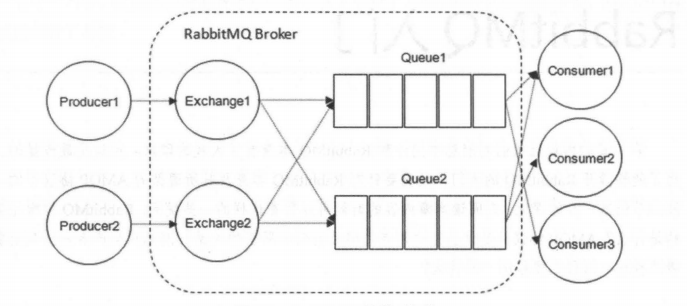

# RabbitMQ

## 简介

RabbitMQ是基于[AMQP协议](../basic/#amqp)的实现

它的开发语言为Erlang, 天然支持高并发, 因此RabbitMQ的消息**时效性可以达到微秒级**, 是一众开源消息中间件中最快的

RabbitMQ有以下优势:

- 灵活路由: 使用交换器来提供更为复杂的路由机制
- 多种协议: 支持AMQP/STOMP/MQTT等
- 多语言: 支持Java/Python/Ruby/PHP/C#/JavaScript等
- 可视化管理界面
- 插件机制

## 架构



RabbitMQ主要有以下内容组成:

- Producer: 生产者
- Exchange: 交换器
- Queue: 队列
- Consumer: 消费者

::: tip

Exchange和Queue组成了其它中间件中的Broker概念

:::

## 特性

### 交换器

RabbitMQ提供了四种交换器:

- direct
- fanout
- topic
- headers

生产者将消息发送到交换器需要RoutingKey

交换器和队列的绑定需要BindingKey, 它是可以重复的

上述四种模式可以理解为RoutingKey和BindingKey的不同匹配方式

#### direct

直连模式, 正如字面意思, 即**RoutingKey与BindingKey相同**才会路由消息:


- warning: 路由到Queue1和Queue2
- info: 路由到Queue2
- test: 无法路由

direct常用在处理**有优先级的任务**，根据任务的优先级把消息发送到对应的队列，这样可以指派更多的资源去处理高优先级的队列

#### fanout

扇出模式, 即**不考虑RoutingKey和BindingKey的关系**, 直接将消息发送至所有Queue

此模式效率最高

#### topic

主题模式, **RoutingKey和BindingKey按照主题规则**进行匹配:

- 主题格式为: `主题.子主题.子主题`
- `*`代表匹配同一级别下的所有主题
- `#`代表匹配当前主题下的所有主题, 且包含当前主题


- `com.rabbitmq.client`: 路由到Queue1和Queue2
- `com.hidden.client`: 路由到Queue2
- `java.util.concurrent`: 无法路由

#### headers

头部信息模式

RabbitMQ的消息可分为headers与payload

头部信息模式则是对**headers中的属性进行匹配**, 不考虑RoutingKey和BindingKey的关系

此模式性能很差, 一般不会使用

### 消息模式

RabbitMQ的消息只能保存在队列中, 与Kafka保存在主题中相反

当多个消费者消费同一队列时, 队列中的消息将会被轮询分摊

所以, **在队列层面, RabbitMQ是不支持发布-订阅模式的**

### 发送确认

通过配置`mandatory`参数可以实现消息的发送确认:

- 配置值为`true`时: 交换器将无法路由的消息返回生产者
- 配置值为`false`时: 交换器将丢弃无法路由的消息

## 安装

推荐使用docker安装RabbitMQ:

```bash
docker run -d --rm --name rabbitmq -p 5672:5672 -p 15672:15672 rabbitmq:3.10-management
```

手动安装等请参照官方文档: [Downloading and Installing RabbitMQ — RabbitMQ](https://www.rabbitmq.com/download.html)

