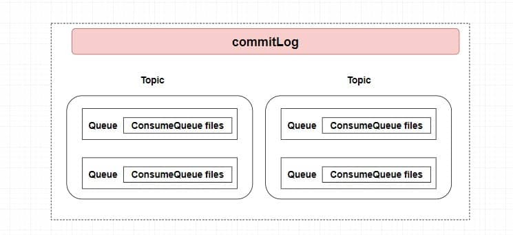

# RocketMQ

## 简介

RocketMQ是阿里巴巴团队开发的消息中间件, 经历过双十一的考验, 且有官方中文文档

已于2016年贡献给Apache, 是其顶级项目之一

官网地址: [Apache RocketMQ](https://rocketmq.apache.org/)

## 结构

- NameServer: 注册中心
- Broker: 消息代理
- Topic: 主题
- Queue: 队列
- Producer: 生产者
- Consumer: 消费者

其中NameServer/Broker/Producer/Consumer都支持集群部署, Broker还支持主从部署

## 特性

### Broker主从部署

主从部署的Broker, **从机只能提供消费消息服务, 不能提供写入消息服务**

提供了共识选举算法方案DLedger, 与Kafka类似

### Broker与Topic

**Broker与Topic是多对多关系**, **Topic与Queue是一对多关系**

一个Broker上会有多个Topic(的多个队列), 一个Topic(的多个队列)分布在多个Broker上

::: tip

RocketMQ的Queue等同于Kafka中的Partition

:::

### 消息事务

消息事务是指: **本地事务和存储消息到消息队列是同一个事务**

RocketMQ利用事务消息+事务反查机制实现了消息事务:

### 定时消息

RocketMQ支持定时消息, 其原理可以理解为延时队列

通过创建指定时间精度的消息队列, 使Broker按照规则将消息发送到消费者进行消费

代码中使用`newSingleThreadScheduledExecutor`实现

### 消费者与队列

在RocketMQ中, **一个队列只会被一个消费者消费**

### 消费者集群

消费者集群部署时, 支持**广播模式**和**集群模式**(只有一个消费者消费)

广播模式时, 一个消息被所有消费者共同消费, 每个消费者保存自己的消费进度

集群模式时, 一个消息只被一个消费者消费, 消费进度保存在Broker上

### 消费原理

RocketMQ存在消费延迟的问题

原因在于Broker并不是真正的将消息主动的推送到消费者, 而是通过消费者定时轮询拉取实现的

### 消费过滤

RocketMQ提供了消息过滤服务

可以在Broker将消息推送给消费者时进行过滤, 消费者拿到的是过滤后的消息

### 回溯消费

RocketMQ中的消息在成功消费后仍然保留

可以按照时间进行回溯消费, 精确到秒

## 持久化

持久化可以简单理解为数据刷盘, 一般有如下两种模式:

- 同步刷盘: 不会丢失数据, 但性能较差, 一般适用于金融等特定业务场景
- 异步刷盘: 性能较高, 但意外宕机可能会造成数据丢失

RocketMQ支持上述两种刷盘策略, 具体实现方式如下:

### 三大角色

- `CommitLog`: 消息存储主体, 单个文件大小默认1G, 文件名为起始偏移量, 长度20位，左边补零, **所有消息按照顺序进行写入**
- `ConsumeQueue`: 消费队列, 每个文件保存30W个条目, 大小约为5.72M, 可以理解为`CommitLog`的索引文件, 保存目录结构为`{topic}/{queueId}/{filename}`, 主要目的是为了提高消费性能
- `IndexFile`: 索引文件, 提供了一种可以通过key或时间区间来查询消息的方法

持久化的主要文件为`CommitLog`/`ConsumeQueue`

::: tip

Kafka中是每个主题一个文件, RocketMQ中是所有队列共用一个文件

这么做的目的是为了**提高写入效率**

:::

### 代码写入

RocketMQ使用`FileChannel`+`DirectBuffer`实现持久化

其中`DirectBuffer`使用堆外内存, 不会被GC随意移动, 所以写入效率会更高

`FileChannel`限制了文件大小为`Integer.MAX_VALUE`, 即2147483647, 所以`CommitLog`大小为1G

