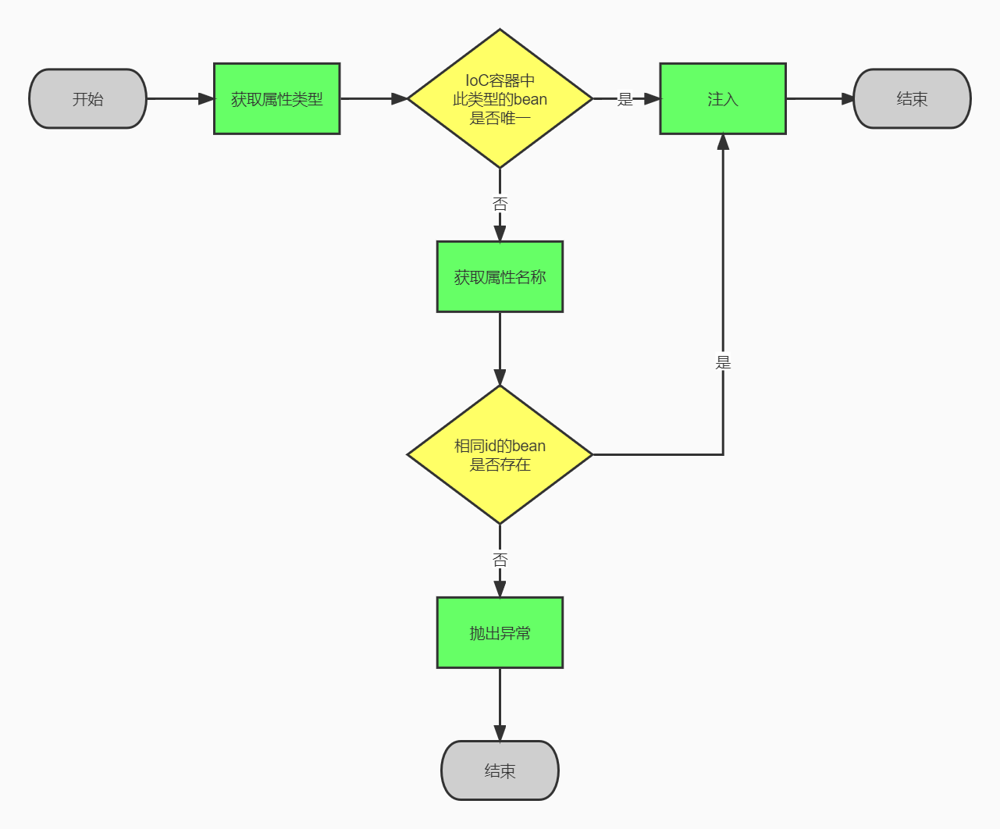

# IoC

## 概念

IoC(**I**nversion **o**f **C**ontrol), 即控制反转, 是一种设计理念, 是Spring的核心功能之一

按照中文进阶解读, 我们往往会习惯于将重点放在`控制`这个词上, 但IoC的主要内容应是`反转`

先说结论, 控制反转是**对象获取依赖方式的反转**

在初学Java时, 我们经常会使用如下这种方式创建对象:

```java
B b = new B();
A a = new A(b);
```

在创建对象`a`之前, 必须先创建它依赖的参数`b`, 然后调用构造方法, 这种创建方式, 我们可以认为是`a`**主动获取**依赖`b`

当对象相互依赖的关系较小时, 还算能看

可当对象依赖的过多或依赖的层级过深时, 上述创建方式简直头大

那么, 设想一下, 如果每个对象之间都知道相互的关系, 并且在创建时会自动关联, 将会是一件多么美妙的事情啊

Spring好像就是这么做的:

```java
@Component
public class A {
    @Autowired
    private B b;
}
```

在Spring中, 我们无需主动创建`b`, 而是使用DI(**D**ependency **I**njection, 依赖注入)的方式将它**赋予**`a`

从主动获取变为赋予, 这就是所谓的**反转**

当然, 如果非要纠结`控制`这个词的话, 我们可以这么理解:

传统方式的对象创建, 需要开发人员手动编码, **对象的控制权在人手中**

而IoC中, 对象的创建一般交由程序自身, 例如Spring的IoC容器, **控制权从人反转到了程序**

::: warning

对象控制权反转并非官方解释, 仅用于理解和记忆

:::

## 依赖注入

依赖注入是Spring实现IoC的方式, 这里简单介绍下几种注入机制

### 多个同类型注入其一

假设存在多个类型为`B`的bean, 如果指定注入哪个?

使用`@Primary`:

```java
public class BeanConfig {
    @Bean
    @Primary
    public B one() {
        return new B();
    }
}
```

使用`@Qualifier`:

```java
@Component
public class A {
    @Autowired
    @Qualifier("one")
    private B b;
}
```

::: tip

`@Qualifier` 不受 `@Primary` 的干扰

:::

变量名:

```java
@Component
public class A {
    @Autowired
    private B one;
}
```

通过上述内容其实可以发现Spring依赖注入的流程:



### 多个同类型全部注入

```java
@Component
public class A {
    @Autowired
    private List<B> bs;
}
```

### 回调注入

使用`ApplicationContextAware`获取`ApplicationContext`:

```java
public class BeanTest implements ApplicationContextAware {
    
    private ApplicationContext ctx;
    
    public void printBeanNames() {
        Stream.of(ctx.getBeanDefinitionNames()).forEach(System.out::println);
    }
    
    @Override
    public void setApplicationContext(ApplicationContext ctx) throws BeansException {
        this.ctx = ctx;
    }
}
```

### 延时注入

使用`ObjectProvider`, 可应用于setter/构造函数/属性, 以构造函数为例:

```java
@Component
public class A {
    private B b;
    
    @Autowired
    public void setB(ObjectProvider<B> b) {
        this.b = b.getIfAvailable();
    }
}
```

### 方式选择

Spring官方推荐使用**构造函数注入**, 并且指出了**如果构造函数的参数过长, 则代表其职责过多, 第一选择是对其进行拆解**, 而不是选择其它的依赖注入方式


